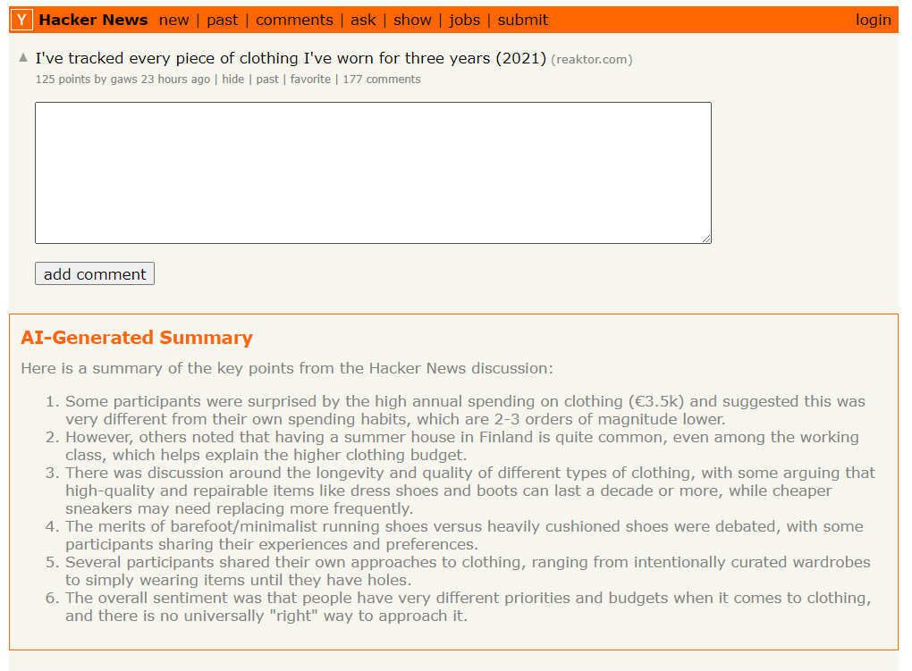

# Hacker News AI Plugin

A chrome extension that summarize the content of Hacker News discussion and answer question about the content.

## Development

1. Clone the repository
2. Run `npm install`
3. Run `npm run build`
4. Load the `dist` folder to chrome://extensions
